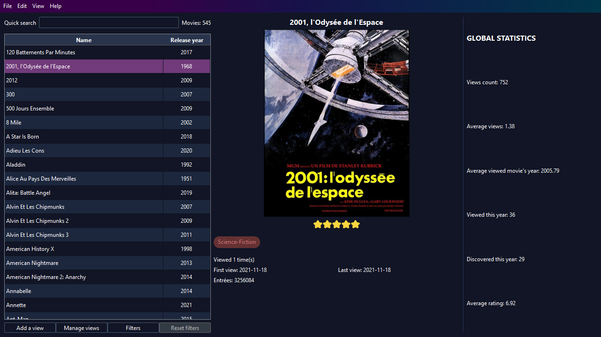

  

    A software to manage which movie you saw and when.

## What is MovieManager
MovieManager is a software that help you manage how many movies you saw, on which support and when. It gives you technical details of movies, stats about everything you watched, such as the number of movies viewed this year, the average release year...

  

## Development
Movie Manager is written in C++ using Qt. It is currently under heavy development. 

## Download
Releases can be found [here](https://github.com/AmbreM71/MovieManager/releases)

## Contributing
Feel free to contribute to MovieManager by:
* Suggesting features [here](https://github.com/AmbreM71/MovieManager/issues)
* Reporting issues or bugs [here](https://github.com/AmbreM71/MovieManager/issues)

Movie Manager is free and open source, if you like it, please star this project on GitHub
